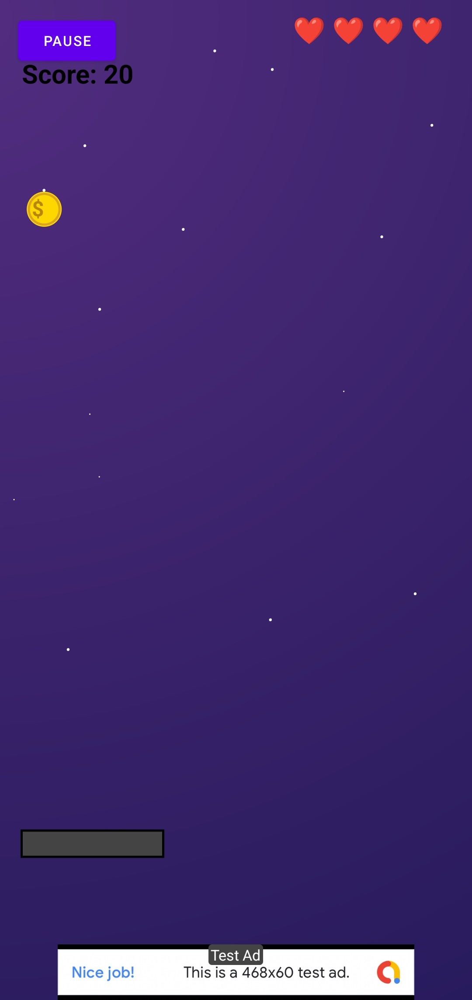
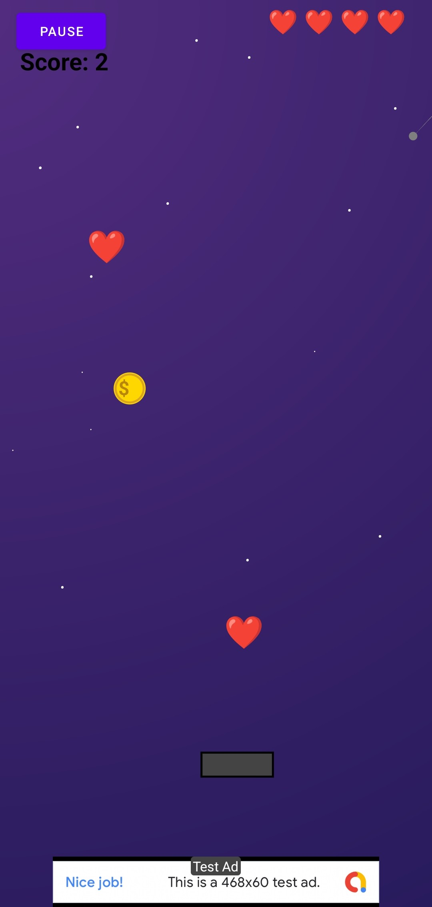

# Coin Catcher

A fun and addictive Android arcade game where you catch coins and avoid missing them!

## Features

*   **Endless Gameplay**: Catch as many coins as you can to increase your score.
*   **Dynamic Difficulty**: The game gets faster and more challenging as you play.
*   **Power-ups**: Catch falling hearts to restore lives (max 5).
*   **Visuals**: Beautiful city skyline background (Lottie Animation) and smooth animations.
*   **Sound Effects**: Satisfying coin collection sounds.
*   **Ad Supported**: Integrated AdMob banner and interstitial ads.

## How to Play

*   **Move**: Touch and drag to move the collector left or right.
*   **Goal**: Catch the falling coins to score points.
*   **Avoid**: Don't let coins fall past you! You lose a life for each missed coin.
*   **Lives**: You start with 3 lives. Catch hearts to regain lost lives.

## Screenshots

  
  
  

## How to Build

1.  Clone the repository.
2.  Open the project in Android Studio.
3.  Sync Gradle files.
4.  Run on an emulator or physical device.

## Credits

Created by **Aryan Singh Negi**.
Powered by **Team CyberNobie**.
